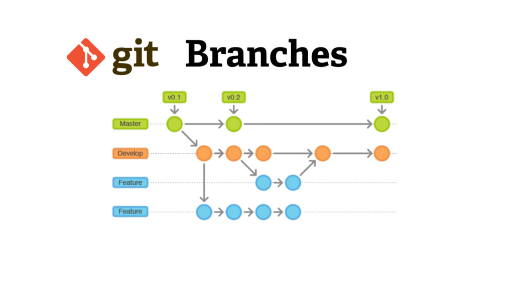

# Как пользоваться гитом?
## Как пользоваться ветками и что это?

Гит - это "Дерево" (система взаимодействия команды разработки над 1 проектом)
Ветка - это индивидуальное пространство разработчика с полной копией исходных данных. В ней разработчик пишет новые функции; Если происходит ошибка или разработчик удалил критически важные куски кода, данных, то разработчик может заново откатиться к началу своей ветки и это никак не отразится на пользователе, потому что основная ветка main остается нетронутой. Благодаря этой системе можно паралелльно выполнять задачи и обезопасить проект от ошибок

GitHub - Это бесплатная веб версия Гита, чтобы все могли пользоваться им как сайтом/приложением (избавляет от необходимости писать код)
--- 
1) Сначала найдите самую актуальную ветку (см. на фото и на список версий)
    - Список актуальных версий веток Гит (номера по возрастанию):
        - main - Неизменная ветка, она всегда первоначальная
        - PCA_{1-4} - Старая ветка, там были первые попытки собрать что-либо
        - AutoReg_{1-4} - Это самая актуальная ветка. Здесь собран итоговый датасет по регионам. Здесь анализируется МГК и применимость компонент в регрессионном анализе

2) Здесь вы увидите папку, в которой лежат данные:
    1) Папка "regional_data" - Это папка с итоговыми датасетами по регионам, они идентичны. Если интересно, как они собираются, это конец кода файла dataframe.ipynb
    2) Папка "Данные" - Это наши сырые данные, откуда собираются и обрабатываются данные для сборки конечного датасета 
    3) Файл "dataframe.ipynb" - Здесь собираются региональные дата сеты (сбор данных из отчета Росстата, приведение к общему индексу, типу данных, проверка консистентности полей файлов (названия регионов везде обозначаются по-разному))
    4) Файл "model.ipynb" - В этом файле идет работа над датасетом с данными по России. Здесь я пишу этапы анализа и моделирования, чтобы соотнести предварительные результаты с Эконометрической теорией и сделать выводы для дальнейших действий. Смотрю на МГК, какие компоненты он дает, как коррелированы регрессоры и компоненты, как будет выглядеть регрессия с компонентами и как интерпретировать результаты модели на регрессоры.
---
## Как читать и пользоваться данными с Гита?
0) Если нужно скачать всю папку, то нужно найти на главной странице кнопку "<> Code" и нажать на неё. В этом

1) Нажмите на любой интересующий вас файл. В верхнем правом углу есть кнопка скачать файл.

2) Гит позволяет просмотреть данные, файлы с кодом и его результатом в онлайн версии, что избавляет от необходимости скачивать данные и перезапускать код на собственном компьютере

---
## Как отправлять туда данные / загружать файлы?
1) Если вы хотите добавить файл с данными / статью / файл с кодом:
    - На главной странице есть зеленая кнопка "<> Code" возле которой есть значок +

2) загрузите файл и 
    - Можете выбрать текущую ветку, чтобы данные просто присоеденились туда (в нашем случае это никак не повлияет на работу)
    - Также можно создать новую ветку, чтобы я мог понять кто и зачем добавил это 
 